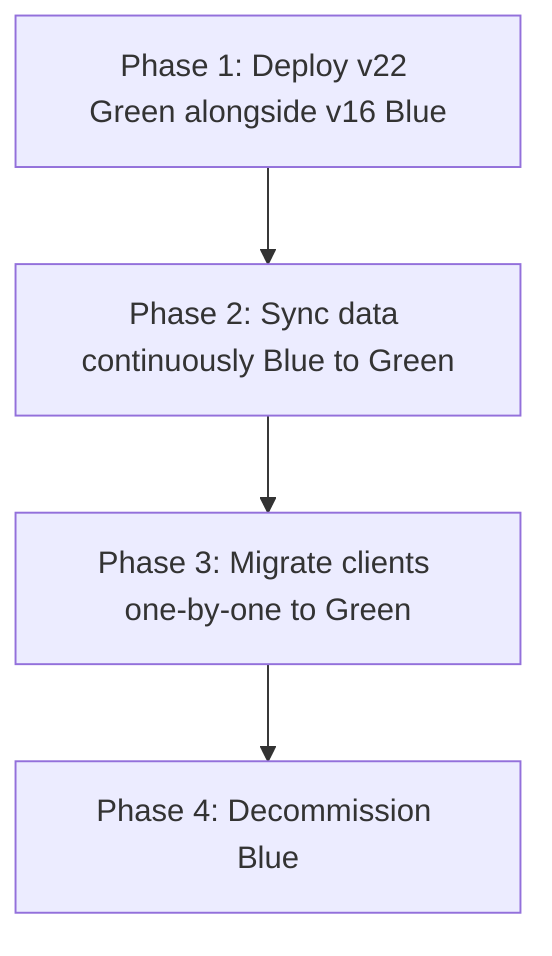

# Zero-Downtime Keycloak Migration: v16 to v22 on Azure

Keycloak v16 to v22 isn't a minor version bump. It's a complete platform rewrite — WildFly to Quarkus runtime, Liquibase to JPA schema management, XML realm exports to partial-import APIs, and a fundamentally different configuration model. We migrated a production instance serving 40,000 daily active users across 12 client applications without a single second of authentication downtime.

## Why the Migration Was Non-Negotiable

Keycloak v16 (WildFly-based) had reached end-of-life. Three factors forced our hand:

1. **CVE-2023-6134 (XSS)** and **CVE-2023-6787 (session fixation)** — unpatched in v16
2. **Java 11 EOL** — WildFly v16 doesn't support Java 17+
3. **Azure App Service deprecation** — Windows containers running WildFly were being deprecated in favor of Linux containers

## The Blue-Green Strategy

We couldn't do a big-bang cutover. Twelve client applications depended on Keycloak for authentication — including production APIs processing financial transactions. The strategy:



### Phase 1: Infrastructure as Code with Bicep

The entire v22 environment was defined in Bicep templates:

```
├── main.bicep
├── modules/
│   ├── app-service.bicep      # Linux container, P2v3 plan
│   ├── postgresql-flex.bicep   # Flexible Server, zone-redundant
│   ├── key-vault.bicep         # Secrets management
│   ├── front-door.bicep        # Global load balancer + WAF
│   ├── monitoring.bicep        # App Insights + alerts
│   └── networking.bicep        # VNet + private endpoints
```

**Key infrastructure decisions**:

| Component | v16 (Legacy) | v22 (Target) | Rationale |
|---|---|---|---|
| Compute | App Service (Windows) | App Service (Linux container) | WildFly → Quarkus requires Linux |
| Database | Azure SQL | PostgreSQL Flexible Server | Keycloak v22 optimized for PostgreSQL |
| Configuration | XML files baked into image | Environment variables + ConfigMap | Twelve-Factor compliance |
| Secrets | App Settings (plain text) | Key Vault references | Security baseline requirement |
| TLS termination | App Service managed | Azure Front Door | WAF + global distribution |

### Phase 2: Data Synchronization

The database schema between v16 and v22 differs significantly — 47 tables renamed, 12 tables added, 8 removed, and dozens of column changes. We couldn't simply point v22 at the v16 database.

**The synchronization pipeline**:

1. **Export** realm configuration from v16 using the Admin REST API (not XML export — too brittle)
2. **Transform** using a custom Java tool: map v16 schema entities to v22 equivalents
3. **Import** into v22 using the partial-import API with `OVERWRITE` strategy
4. **Sync** users, credentials, and sessions using a CDC (Change Data Capture) pipeline from Azure SQL → Event Hub → PostgreSQL

**The hardest problem**: password credential migration. Keycloak v16 stores password hashes with `HmacSHA256` wrapping. V22 uses `PBKDF2-SHA512` by default. We configured v22 to support both hash algorithms — on first login after migration, the user's password is transparently re-hashed with the new algorithm. No forced password resets.

### Phase 3: Client Migration

Twelve applications, migrated one at a time over 6 weeks:

**Week 1-2**: Internal tools (3 apps) — low risk, fast rollback
**Week 3-4**: Partner-facing APIs (4 apps) — medium risk, coordinated with partners
**Week 5-6**: Customer-facing applications (5 apps) — high risk, canary deployment

Each client migration followed the same procedure:

1. Register the client in v22 with identical `client_id` and configuration
2. Update the application's OIDC discovery URL: `old.keycloak.example.com` → `new.keycloak.example.com`
3. Deploy the application update behind a feature flag
4. Enable for 5% of traffic (canary)
5. Monitor authentication success rate, token validation errors, session duration
6. Ramp to 100% over 24 hours

**Azure Front Door** made the traffic splitting seamless — origin groups with weighted routing, no application-level changes needed for the canary.

### The Rollback That Saved Us

Client #7 — a payment processing API — failed canary at 5% traffic. Root cause: the application used a **custom Keycloak protocol mapper** that generated a non-standard JWT claim. V22's updated protocol mapper SPI had a different interface.

**What happened**: Authentication succeeded, but the custom claim was missing from the access token. The downstream payment processor rejected every request with a 403.

**The fix**: We rolled back client #7 to v16 within 4 minutes (Front Door origin switch). Then we ported the custom protocol mapper to v22's new SPI, deployed it as a custom provider JAR in the Keycloak container, and re-tested. Client #7 migrated successfully 3 days later.

**Lesson**: The rollback strategy wasn't just insurance — it was a feature we actively used. Without per-client rollback capability, this migration would have required a maintenance window.

## Session Continuity

The most visible quality metric: **no user should be forced to re-login during migration**. We achieved this through **distributed session replication**:

1. V16 sessions are exported to Redis (Infinispan → Redis bridge)
2. V22 reads the Redis session store on startup
3. Session format transformation happens at read time (lazy migration)
4. Once a session is accessed on v22, it's written back in v22 format

In practice, users experienced zero authentication disruption. Sessions created on v16 were seamlessly honored by v22.

## Infrastructure Monitoring

The migration dashboard tracked five golden signals:

| Signal | Alert Threshold | During Migration |
|---|---|---|
| Auth success rate | < 99.5% | 99.94% |
| Token issuance latency (P95) | > 500ms | 180ms |
| Session creation rate | ±20% from baseline | +3% (expected) |
| Error rate (5xx) | > 0.5% | 0.02% |
| Active sessions | ±30% from baseline | -1% (session timeout overlap) |

## Bicep Deployment Automation

The entire migration was repeatable. We ran it 7 times in staging before touching production. The Bicep templates plus the data transformation tool meant we could spin up a complete v22 environment in 23 minutes and run the full migration rehearsal.

```
az deployment group create \
  --resource-group rg-keycloak-prod \
  --template-file main.bicep \
  --parameters @params.prod.json
```

Total infrastructure cost delta: +$89/month. The PostgreSQL Flexible Server is slightly more expensive than Azure SQL Basic, but v22's Quarkus runtime uses 40% less memory than v16's WildFly — so we downsized the App Service plan from P3v3 to P2v3.

## What I Learned

**Per-client migration is worth the complexity.** It took 6 weeks instead of 1 weekend, but we had zero downtime and caught 3 issues that would have been production incidents in a big-bang cutover.

**Custom extensions are the migration killer.** Standard Keycloak features migrated flawlessly. Every custom provider, protocol mapper, and SPI implementation required manual porting. Audit your customizations before estimating timeline.

**IaC rehearsals build confidence.** Running the full migration 7 times in staging wasn't just testing — it trained the team. By production day, every step was muscle memory. The actual production migration was the least stressful run.
