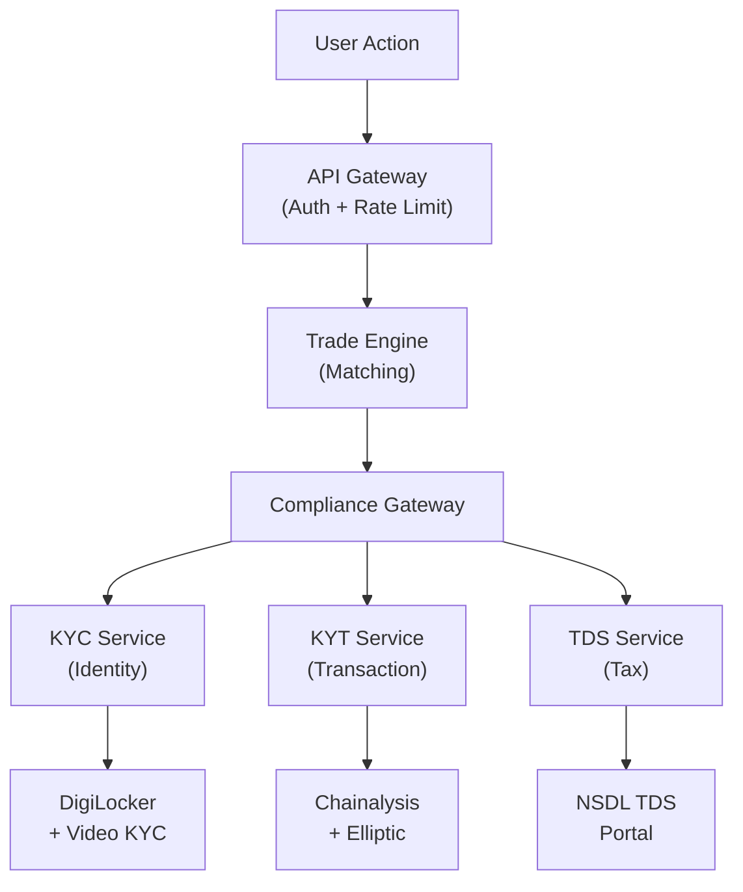

# P2P Exchange Compliance Architecture

Building a peer-to-peer cryptocurrency exchange in India means navigating a regulatory environment where the rules are simultaneously strict and ambiguous. CryptoWala operates under RBI guidelines for virtual digital asset (VDA) service providers — requiring full KYC verification, transaction monitoring, suspicious activity reporting, and 1% TDS deduction on every trade. This is the compliance architecture that makes it work.

## The Regulatory Landscape

Indian VDA regulations require:

| Requirement | Regulation | Implementation |
|---|---|---|
| Identity verification | PML Act, 2002 | Video KYC + document verification |
| Transaction monitoring | FIU-IND guidelines | Real-time on-chain + off-chain analysis |
| Suspicious activity reporting | PMLA Rules, 2023 | Automated STR filing within 7 days |
| Tax deduction at source | Section 194S (1% TDS) | Per-transaction TDS calculation and deposit |
| Travel rule compliance | FATF Rec. 16 | Originator/beneficiary data for transfers > ₹50,000 |
| Record retention | PML Act | 5-year retention of all KYC records and transaction logs |

## Architecture Overview

The compliance layer sits between the trading engine and the settlement layer — every trade must pass through compliance checks before funds move:



### The Compliance Gateway Pattern

Every trade flows through a **Compliance Gateway** — a synchronous orchestrator that runs checks in parallel and aggregates results:

```
ComplianceResult = {
  kyc_status: VERIFIED | PENDING | REJECTED
  risk_score: 0-100 (composite)
  sanctions_clear: boolean
  tds_amount: Decimal
  travel_rule_satisfied: boolean
  decision: APPROVE | HOLD | REJECT
}
```

The gateway applies a **decision matrix**:

| KYC Status | Risk Score | Sanctions | Decision |
|---|---|---|---|
| VERIFIED | 0-30 | Clear | APPROVE |
| VERIFIED | 31-70 | Clear | APPROVE + Enhanced Monitoring |
| VERIFIED | 71-100 | Clear | HOLD for Manual Review |
| VERIFIED | Any | Flagged | REJECT + STR Filing |
| PENDING/REJECTED | Any | Any | REJECT |

Trades in HOLD state require manual review by a compliance officer within 24 hours. The system never auto-approves high-risk transactions.

## KYC: Identity Verification

### Video KYC Flow

India's SEBI and RBI guidelines mandate Video KYC for VDA service providers. Our implementation:

1. **Document Collection**: Aadhaar + PAN card upload with liveness detection
2. **DigiLocker Verification**: Direct API integration to verify documents against government databases (no local PII storage)
3. **Video Interview**: Automated 90-second video session with:
   - Face match against document photo (> 95% confidence threshold)
   - Liveness detection (anti-spoofing: blink detection, head turn prompts)
   - OTP verification during video session
   - Session recording stored in encrypted S3 (AES-256, KMS-managed keys)

### PII Architecture: The Vault Pattern

PII is stored in a dedicated **identity vault** — a separate database with:

- **Encryption at rest**: AES-256 with per-field encryption keys
- **Encryption in transit**: mTLS between all services
- **Access logging**: Every PII access is logged with accessor identity, timestamp, and purpose
- **Tokenization**: The trading engine never sees PII — it operates on opaque user tokens
- **Retention policy**: Automated purge 5 years after account closure (PML Act compliance)

The trading engine, the matching engine, and the settlement layer all operate on tokenized user IDs. If the trading database is compromised, no PII is exposed.

## KYT: Know Your Transaction

### On-Chain Risk Scoring

Every crypto deposit and withdrawal runs through on-chain analysis:

1. **Address Screening**: Check against OFAC SDN list, EU sanctions list, and India's UAPA designated list
2. **Cluster Analysis**: Identify if the address belongs to known entities (exchanges, mixers, darknet markets)
3. **Transaction Tracing**: Follow the fund flow 3 hops back to identify indirect exposure to high-risk sources
4. **Risk Scoring**: Composite score based on:

```
risk_score = w1 × S_sanctions + w2 × S_mixer + w3 × S_darknet + w4 × S_gambling + w5 × S_scam
```

Where weights are calibrated quarterly based on India-specific risk factors:

| Category | Weight | Threshold for HOLD |
|---|---|---|
| Sanctions exposure | 0.40 | Any > 0 |
| Mixer/tumbler | 0.25 | > 10% exposure |
| Darknet market | 0.20 | > 5% exposure |
| Gambling | 0.10 | > 30% exposure |
| Known scam | 0.05 | > 15% exposure |

### Dual Provider Strategy

We integrate with both **Chainalysis** (primary) and **Elliptic** (secondary) for on-chain analysis. Why two providers?

1. **Coverage gaps**: Chainalysis has better Bitcoin/Ethereum coverage; Elliptic has better coverage for newer chains
2. **Failover**: If Chainalysis API is down, Elliptic provides continuity
3. **Cross-validation**: For high-value transactions (> ₹10 lakh), both providers must agree on the risk assessment

## TDS Integration

Section 194S requires 1% TDS on every VDA transfer. The complexity:

- TDS applies to the **buyer** (the person acquiring VDA)
- Must be deducted **at the time of credit** to the seller
- Must be deposited to the government **within 7 days** of the following month
- PAN verification is required for both parties

Our TDS service:

1. Calculates 1% of transaction value at trade execution time
2. Holds the TDS amount in an escrow account
3. Generates Form 26QE for each transaction
4. Files consolidated TDS returns monthly via NSDL TIN integration
5. Issues Form 16E to users quarterly

All calculations use `BigDecimal` with `ROUND_HALF_UP` — floating-point arithmetic is never acceptable for tax calculations.

## Audit Trail

Every compliance decision is written to an append-only audit log:

```
{
  "event_id": "uuid",
  "timestamp": "2025-11-20T14:30:00Z",
  "trade_id": "T-2025-001234",
  "user_token": "USR-abc123",
  "check_type": "KYT_SCREENING",
  "provider": "chainalysis",
  "input_hash": "sha256:...",
  "risk_score": 23,
  "decision": "APPROVE",
  "reviewer": "SYSTEM",
  "regulatory_basis": "FIU-IND-AML-2023-Rule-7.3"
}
```

Audit logs are:
- **Immutable**: Written to Amazon QLDB (quantum-resistant hash chain)
- **Tamper-evident**: Each entry references the hash of the previous entry
- **Exportable**: Monthly exports in FIU-IND prescribed format for regulatory submission
- **Retained**: 8-year retention (exceeding the 5-year statutory minimum)

## What I Learned

**Compliance is a product feature.** Users trust a platform that visibly demonstrates regulatory compliance. Our KYC completion rate is 89% — significantly above industry average — because the UX communicates *why* each step is necessary.

**Dual-provider architecture pays for itself.** The first time Chainalysis had a 4-hour outage, our platform continued operating while competitors halted withdrawals. The additional cost (~2K/month) is trivial compared to the revenue loss of 4 hours of downtime.

**Tax integration is the hardest part.** The TDS calculation logic is straightforward. Integrating with India's NSDL/TIN infrastructure — with its SOAP APIs, manual certificate renewals, and undocumented error codes — consumed more engineering time than the entire KYT integration.
