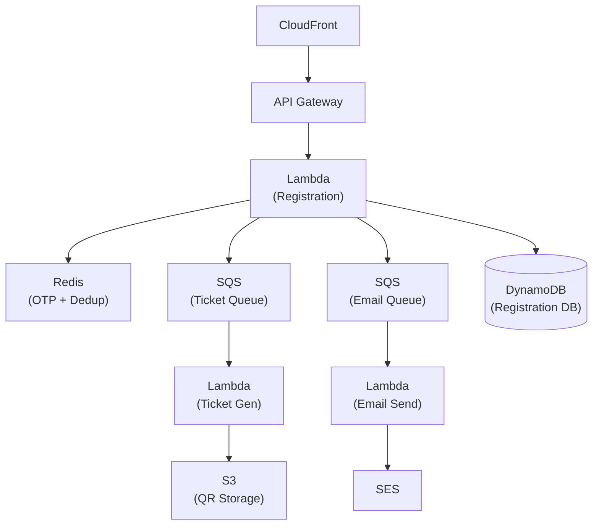

# Scaling to 200K Signups per Minute with AWS Lambda

When the Bitcoin India Conference announced free registrations on national television, we had 45 minutes of warning before our platform received 200,000 concurrent signup attempts per minute. This is the architecture that handled it — and the decisions made months before that made it possible.

## The Problem

Conference registration looks simple: collect name, email, phone → verify OTP → generate ticket → send confirmation. But at scale, every step becomes a distributed systems problem:

- **OTP generation**: 200K SMS messages per minute through rate-limited telecom APIs
- **Deduplication**: Same user submitting 5 times because "the button didn't work"
- **Ticket generation**: QR code rendering is CPU-intensive
- **Email delivery**: SES has per-second sending quotas
- **Database writes**: 3,300+ writes per second sustained

## Architecture Overview



Every component was chosen for horizontal scalability with zero coordination overhead.

## Key Design Decisions

### 1. CloudFront + Turnstile as the First Line of Defense

Before a single Lambda invocation fires, CloudFront serves the static registration page from edge locations. Cloudflare Turnstile (not reCAPTCHA — better UX, no puzzle friction) runs client-side to filter bots.

This alone eliminated ~35% of incoming traffic. Bots scraping the registration endpoint were blocked before hitting our compute layer.

### 2. Redis OTP with Sliding Window Dedup

The OTP flow uses Redis with a carefully designed key structure:

```
otp:{phone}:value     → 6-digit code (TTL: 300s)
otp:{phone}:attempts  → attempt counter (TTL: 300s)
otp:{phone}:cooldown  → rate limit flag (TTL: 60s)
dedup:{phone}:{email} → registration lock (TTL: 600s)
```

**Why Redis over DynamoDB for OTP?** DynamoDB's eventual consistency model means a user could submit twice before the dedup record propagates. Redis (ElastiCache, single-node) gives us strong consistency with sub-millisecond reads. For the dedup use case, we need exactly-once semantics within a 10-second window.

**Sliding window rate limiting**: Each phone number gets maximum 3 OTP requests per 5-minute window. The `cooldown` key enforces a 60-second minimum gap between requests, preventing SMS bombing.

### 3. Lambda Concurrency — The Counterintuitive Constraint

AWS Lambda can scale to thousands of concurrent executions. But **unreserved concurrency is shared across your entire account**. During the spike, our registration Lambdas consumed 3,000 concurrent executions — which would have starved our ticket generation and email sending Lambdas.

The fix: **Reserved concurrency quotas**.

| Function | Reserved Concurrency | Rationale |
|---|---|---|
| Registration | 3,000 | Front-door, must stay responsive |
| OTP Verification | 1,000 | Lower volume (only verified users proceed) |
| Ticket Generation | 500 | CPU-heavy, can tolerate 2-3s queue delay |
| Email Sending | 200 | SES rate limit is the bottleneck anyway |

This creates implicit **backpressure**: when registration Lambdas hit 3,000 concurrent, API Gateway returns 429 and the client retries with exponential backoff. Better to shed load gracefully than to starve downstream services.

### 4. SQS as the Shock Absorber

The critical insight: **registration confirmation and ticket delivery don't need to be synchronous**. The user's journey is:

1. Submit form → immediate acknowledgment ("Registration received")
2. Verify OTP → synchronous (must happen now)
3. Generate ticket → async (SQS → Lambda → S3)
4. Send confirmation email with ticket → async (SQS → Lambda → SES)

By decoupling steps 3 and 4 into SQS queues, the registration Lambda does minimal work: validate input, check dedup, write to DynamoDB, enqueue two messages. Total execution time: ~80ms.

SQS queues absorb the spike. Even if ticket generation falls behind, registrations keep flowing. During the peak, the ticket queue depth reached 45,000 messages — but it drained completely within 12 minutes as Lambda scaled up ticket generators.

### 5. DynamoDB Single-Table Design

One table. Four access patterns:

| Access Pattern | PK | SK |
|---|---|---|
| Get registration by ID | `REG#<id>` | `META` |
| Get by email | `EMAIL#<email>` | `REG#<id>` |
| Get by phone | `PHONE#<phone>` | `REG#<id>` |
| List by timestamp | `DATE#<date>` | `TS#<timestamp>#<id>` |

DynamoDB auto-scales write capacity, but we pre-provisioned 5,000 WCU to avoid the 5-minute scaling lag. Total DynamoDB cost for the event: $47.

## The Numbers

| Metric | Value |
|---|---|
| Peak concurrent users | 200,000/min |
| Total registrations | 380,000 |
| P99 registration latency | 340ms |
| P99 OTP verification latency | 180ms |
| Lambda cold starts (% of invocations) | 0.3% |
| Failed registrations (legitimate) | 0.02% |
| Total AWS cost for event day | $312 |
| Equivalent EC2 cost (estimated) | $2,800+ |

## Lessons Learned

**Pre-warm aggressively**: We ran a load test 2 hours before the event. Lambda keeps execution environments warm for ~15 minutes. This eliminated cold starts for the initial surge.

**Monitor the right metric**: Total invocations is a vanity metric. **Concurrent executions** is the one that matters — it's what triggers throttling.

**SQS Dead Letter Queues saved us**: 127 ticket generation attempts failed (malformed QR data edge case). Without DLQ, those registrations would have been silently lost. We reprocessed them the next morning.

**Cost efficiency of serverless at scale**: The entire event-day infrastructure cost $312. A pre-provisioned EC2 cluster sized for peak would have cost $2,800+/day — and we'd have paid for it during the 23 hours of low traffic too.
